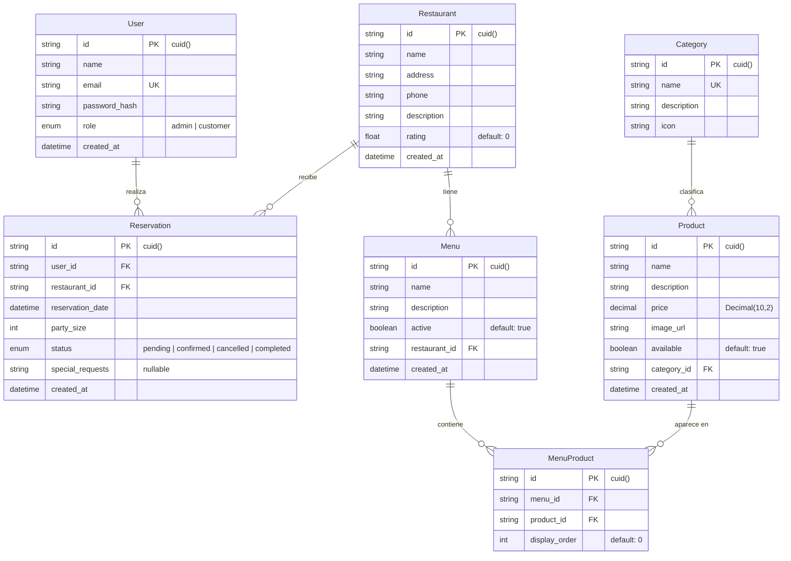

# 🍽️ PY01 Restaurantes — Microservicios con Persistencia Políglota

**Repo**: https://github.com/xHellish/proy1-bd2-restaurantes
**Swagger UI**: http://localhost/api/docs (después de desplegar)

> Sistema de restaurantes con arquitectura de microservicios, persistencia políglota (PostgreSQL ↔ MongoDB), MongoDB Sharded Cluster, Elasticsearch, Redis y escalabilidad horizontal con Kubernetes.

---

## 📋 Índice

1. [Requisitos](#1-requisitos)
2. [Despliegue Completo](#2-despliegue-completo)
3. [Carga de Datos Ficticios (Seed)](#3-carga-de-datos-ficticios-seed)
4. [Cambiar Motor de Base de Datos](#4-cambiar-motor-de-base-de-datos)
5. [Escalabilidad Horizontal (Kubernetes)](#5-escalabilidad-horizontal-kubernetes)
6. [Modelos de Datos](#6-modelos-de-datos)
7. [CI/CD — GitHub Actions](#7-cicd--github-actions)
8. [Pruebas](#8-pruebas)
9. [Endpoints Principales](#9-endpoints-principales)
10. [Comandos Útiles](#10-comandos-útiles)

---

## 1. Requisitos

| Requisito | Mínimo |
|-----------|--------|
| Docker Desktop | 20.10+ (con Docker Compose v2) |
| RAM disponible | **8 GB** (el cluster sharded usa ~4 GB) |
| Node.js | 22+ (solo para desarrollo local sin Docker) |
| Kubernetes | Docker Desktop con K8s habilitado (solo para sección 5) |

---

## 2. Despliegue Completo

### 2.1 — Clonar y levantar

```bash
git clone https://github.com/xHellish/proy1-bd2-restaurantes
cd proy1-bd2-restaurantes

# Levantar todo el stack (20 contenedores)
docker compose up --build -d
```

> ⏱️ **Primera vez**: ~2-3 minutos (descarga de imágenes + build).
> El stack incluye: PostgreSQL, MongoDB Sharded Cluster (9 nodos + Mongos + 3 init containers), Redis, Elasticsearch, 2 microservicios y Nginx.

### 2.2 — Verificar que todo esté corriendo

```bash
docker compose ps
```

- Servicios principales → estado `Up (healthy)`
- Init containers (`configsvr-setup`, `shards-setup`, `sharding-setup`) → `Exited (0)` ✅ (es normal, son one-shot)

### 2.3 — Verificar acceso

```bash
# Health check general
curl http://localhost/api/health

# Swagger UI (abrir en navegador)
http://localhost/api/docs
```

Respuesta esperada del health check:
```json
{
  "status": "ok",
  "services": {
    "postgres": { "status": "up" },
    "mongo": { "status": "up" },
    "redis": { "status": "up" }
  }
}
```

---

## 3. Carga de Datos Ficticios (Seed)

Con la infraestructura levantada:

```bash
docker compose exec -w /app/services/api api node ../../infra/scripts/seed-data.js
```

> **¿Por qué `-w /app/services/api`?** El script reutiliza `db.js` del API, que necesita resolver `@prisma/adapter-pg` instalado en el workspace del servicio.

### Datos que se insertan

| Entidad | Cantidad | Detalle |
|---------|----------|---------|
| Categorías | 8 | Entradas, Platos Fuertes, Pastas, Mariscos, etc. |
| Restaurantes | 5 | Establecimientos guatemaltecos ficticios |
| Productos | 32 | Platos y bebidas con precios y descripciones |
| Usuarios | 5 | 1 admin + 4 customers |
| Menús | 5 | Un menú por restaurante |
| Reservaciones | 10 | Diferentes estados (pending, confirmed, etc.) |

### Verificación rápida

```bash
curl http://localhost/api/restaurants   # Listar restaurantes
curl http://localhost/api/products      # Listar productos
curl http://localhost/api/categories    # Listar categorías
```

---

## 4. Cambiar Motor de Base de Datos

El sistema usa el **Patrón Repository** para abstraer la persistencia. El cambio es **solo una variable de entorno**:

```bash
# 1. Editar .env
DB_ENGINE=mongodb    # Opciones: postgres (default) | mongodb

# 2. Recrear stack desde cero
docker compose down -v
docker compose up --build -d

# 3. Cargar seed en MongoDB
docker compose exec -w /app/services/api api node ../../infra/scripts/seed-data.js
```

> ⚠️ El flag `-v` elimina todos los volúmenes (datos de PostgreSQL, MongoDB, Elasticsearch). Es necesario al cambiar de motor.

---

## 5. Escalabilidad Horizontal (Kubernetes)

### 5.1 — Prerequisitos

- Docker Desktop → Settings → Kubernetes → ✅ **Enable Kubernetes** → Apply & Restart

### 5.2 — Desplegar

```bash
# Aplicar manifiestos (ejecutar 2 veces si hay error de namespace)
kubectl apply -f k8s/
kubectl apply -f k8s/   # Segunda vez para resolver dependencia del namespace
```

### 5.3 — Verificar pods

```bash
kubectl get pods -n restaurantes
```

Resultado esperado: **3 pods API** + **2 pods Search**, todos `Running`.

### 5.4 — Escalar

```bash
# Escalar API de 3 a 6 réplicas
kubectl scale deployment api-deployment --replicas=6 -n restaurantes

# Observar en tiempo real
kubectl get pods -n restaurantes -w

# Escalar hacia abajo
kubectl scale deployment api-deployment --replicas=2 -n restaurantes
```

### 5.5 — Limpieza

```bash
kubectl delete -f k8s/
```

### Manifiestos incluidos (`k8s/`)

| Archivo | Recurso | Descripción |
|---------|---------|-------------|
| `namespace.yaml` | Namespace | `restaurantes` — aislamiento de recursos |
| `configmap.yaml` | ConfigMap | Variables compartidas (`DB_ENGINE`, puertos) |
| `api-deployment.yaml` | Deployment | API con **3 réplicas**, 256Mi-512Mi RAM, 200m-500m CPU |
| `api-service.yaml` | Service (ClusterIP) | Balanceador interno del API |
| `search-deployment.yaml` | Deployment | Search con **2 réplicas** |
| `search-service.yaml` | Service (ClusterIP) | Balanceador interno de Search |
| `ingress.yaml` | Ingress | Enrutamiento externo: `/api/*` → API, `/search/*` → Search |

---

## 6. Modelos de Datos

### 6.1 — Esquema Relacional (PostgreSQL — Prisma)



### 6.2 — MongoDB Sharding

Cuando `DB_ENGINE=mongodb`, las colecciones se distribuyen mediante **hashed sharding** en 2 shards (cada uno con 3 réplicas):

| Colección | Shard Key | Estrategia |
|-----------|-----------|------------|
| `products` | `productId` | Hashed — distribución uniforme |
| `reservations` | `userId` | Hashed — aislamiento por tenant |
| `menus` | `restaurantId` | Hashed — agrupación por restaurante |

**Infraestructura MongoDB**: 3 Config Servers (`configrs0`) + Shard 1 (`shard1rs0`, 3 nodos) + Shard 2 (`shard2rs0`, 3 nodos) + Mongos Router.

### 6.3 — Índice Elasticsearch

Elasticsearch indexa los **productos** para búsqueda full-text con multi-match sobre `name` y `description`. Los productos sin descripción se normalizan a `"Producto sin descripción"`.

### 6.4 — Redis Cache

| Recurso | TTL |
|---------|-----|
| Productos (`/api/products`) | 5 min |
| Menús y Categorías (`/api/menus`, `/api/categories`) | 10 min |
| Resultados de búsqueda (`/search/*`) | 10 min |

Política de evicción: `allkeys-lru`, límite 256MB.

---

## 7. CI/CD — GitHub Actions

### Workflows

| Archivo | Trigger | Descripción |
|---------|---------|-------------|
| `ci.yml` | Push/PR a `main` | Pipeline principal: test → build → publish |
| `docker-publish.yml` | Manual o semanal (dom 2AM UTC) | Build y publish de imágenes |
| `pre-commit.yml` | PR a `main`/`develop` | Lint, validación de versiones pinned, check de `console.log` |

### Pipeline Principal (`ci.yml`)

```
┌─────────────────────────┐     ┌──────────────────────────┐     ┌────────────┐
│  Stage 1: Test & Quality│────▶│  Stage 2: Build & Push   │────▶│  Notify    │
│  (push + PR a main)     │     │  (solo push a main)      │     │            │
├─────────────────────────┤     ├──────────────────────────┤     └────────────┘
│ • npm ci (root + wksp)  │     │ • Docker Buildx          │
│ • ESLint                │     │ • Login a ghcr.io        │
│ • Jest API + coverage   │     │ • Build & push:          │
│ • Jest Search + coverage│     │   - api image            │
│ • Cobertura ≥ 90%       │     │   - search image         │
└─────────────────────────┘     └──────────────────────────┘
```

### ¿Qué pasa después de que los tests pasan?

1. **Solo en push a `main`** (no en PRs): se ejecuta el Stage 2.
2. Se construyen **2 imágenes Docker** en paralelo (matrix: `[api, search]`).
3. Se publican en **GitHub Container Registry** (`ghcr.io`):

| Package | Imagen |
|---------|--------|
| API Service | `ghcr.io/xhellish/proy1-bd2-restaurantes-api` |
| Search Service | `ghcr.io/xhellish/proy1-bd2-restaurantes-search` |

4. Tags generados automáticamente por cada push:
   - `latest` (rama default)
   - `main` (nombre de rama)
   - `main-<sha>` (commit específico)

5. Se usa **cache de registro** (`buildcache`) para acelerar builds futuros.

### Servicios levantados en CI

El job de test levanta contenedores de servicio en GitHub Actions:

| Servicio | Imagen | Puerto |
|----------|--------|--------|
| PostgreSQL | `postgres:16-alpine` | 5432 |
| MongoDB | `mongo:8` | 27017 |
| Redis | `redis:7-alpine` | 6379 |
| Elasticsearch | `elasticsearch:8.15.5` | 9200 |

---

## 8. Pruebas

```bash
# Todos los tests (API + Search)
npm test

# Con cobertura
npm test -- --coverage

# Solo un workspace
npm --workspace services/api test
npm --workspace services/search test
```

**Threshold de cobertura**: 90% líneas, 90% funciones, 90% statements, 80% branches.

---

## 9. Endpoints Principales

### API (`/api/*`) — requiere autenticación para escritura

| Método | Ruta | Auth |
|--------|------|------|
| `POST` | `/api/auth/register` | ❌ |
| `POST` | `/api/auth/login` | ❌ |
| `GET` | `/api/products` | ❌ (cached 5min) |
| `POST/PUT/DELETE` | `/api/products/:id` | ✅ Admin |
| `GET` | `/api/menus` | ❌ (cached 10min) |
| `GET` | `/api/categories` | ❌ (cached 10min) |
| `GET/POST` | `/api/reservations` | ✅ |
| `GET/POST` | `/api/restaurants` | POST: ✅ Admin |

### Search (`/search/*`) — público

| Método | Ruta | Descripción |
|--------|------|-------------|
| `GET` | `/search/products?q=pizza` | Búsqueda full-text |
| `GET` | `/search/products/category/:id` | Por categoría |
| `POST` | `/search/reindex` | Reindexar (admin) |

---

## 10. Comandos Útiles

### Docker Compose

```bash
# Levantar todo
docker compose up --build -d

# Ver logs en tiempo real
docker compose logs -f api search

# Escalar a 3 instancias del API
docker compose up -d --scale api=3

# Apagar (conservar datos)
docker compose down

# Apagar + eliminar volúmenes (reset total)
docker compose down -v

# Rebuild solo un servicio
docker compose build api && docker compose up -d
```

### Verificación de Sharding

```bash
docker exec -it py01_mongos mongosh
# En mongosh:
sh.status()
# Debe mostrar: 2 shards, 3 colecciones sharded
```

### Verificación de Redis

```bash
docker exec -it py01_redis redis-cli
KEYS "cache:*"
TTL "cache:/api/products"
```

### Verificación de Elasticsearch

```bash
curl http://localhost:9200/_cat/indices
curl "http://localhost/search/products?q=pizza"
```

---

## 📁 Estructura de Carpetas

```
PY01_Restaurantes/
├── services/
│   ├── api/                        # Microservicio CRUD + Auth
│   │   ├── src/
│   │   │   ├── routes/             # Controllers REST
│   │   │   ├── services/           # Lógica de negocio
│   │   │   ├── repositories/       # Patrón Repository
│   │   │   │   ├── interfaces/     # Contratos
│   │   │   │   ├── postgres/       # Prisma 7
│   │   │   │   └── mongodb/        # Mongoose 9
│   │   │   ├── indexers/           # Sync a Elasticsearch
│   │   │   └── middlewares/        # Auth, cache, rate-limit
│   │   ├── prisma/migrations/      # Migraciones SQL
│   │   ├── tests/                  # Jest (22+ archivos)
│   │   └── Dockerfile
│   └── search/                     # Microservicio de búsqueda
│       ├── src/
│       ├── tests/
│       └── Dockerfile
├── infra/
│   ├── nginx/nginx.conf            # Reverse proxy + LB
│   ├── mongo/                      # Scripts init sharding
│   └── scripts/seed-data.js        # Datos ficticios
├── k8s/                            # Manifiestos Kubernetes
├── .github/workflows/              # CI/CD pipelines
│   ├── ci.yml                      # Test + Build + Publish
│   ├── docker-publish.yml          # Publish manual/scheduled
│   └── pre-commit.yml              # Quality checks
├── docs/                           # Documentación técnica extendida
├── docker-compose.yml              # Stack completo (20 servicios)
├── docker-compose.test.yml         # Stack para tests
├── .env                            # Variables de entorno
└── ARCHITECTURE.md                 # Documentación C4 + data flows
```

---

> **Bases de Datos 2 — Universidad del Valle de Guatemala**
