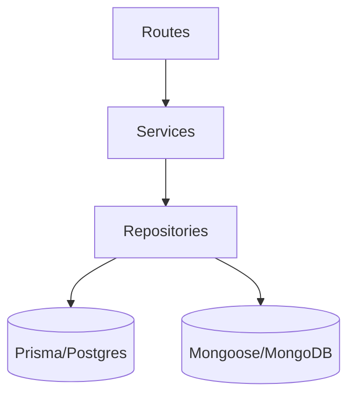

# C4 - Componentes API

```mermaid
flowchart TB
  routes[Routes]
  services[Services]
  repos[Repositories]
  routes --> services
  services --> repos
  repos --> postgres[(Prisma/Postgres)]
  repos --> mongodb[(Mongoose/MongoDB)]
```
