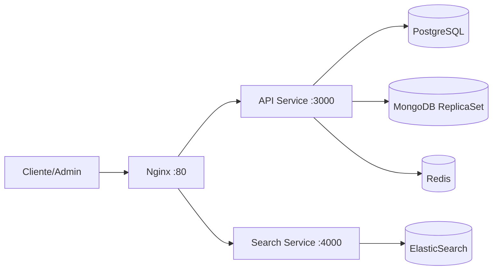

# C4 - Contenedores

```mermaid
flowchart LR
  user[Cliente/Admin] --> nginx[Nginx :80]
  nginx --> api[API Service :3000]
  nginx --> search[Search Service :4000]
  api --> pg[(PostgreSQL)]
  api --> mongo[(MongoDB ReplicaSet)]
  api --> redis[(Redis)]
  search --> es[(ElasticSearch)]
```
